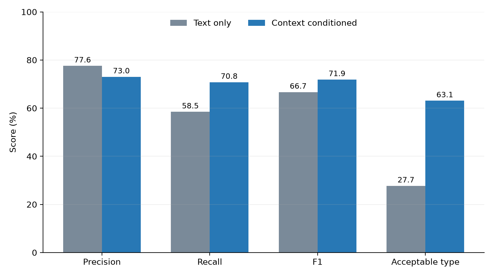

# C3 Final Results Package

> Freeze date: 2026-09-20
>
> Status: C3 formal experiments complete; final packaging and interpretation frozen.

## Scope

C3 evaluates execution-before risk judgments for supplied high-level GUI actions. Every judgment is made in shadow mode and does not alter C2 action selection, budgets, execution, or replay. The experiments measure recognition and traceability, not risk blocking or end-to-end safety.

Two complementary formal evaluations are retained:

1. **Exploration-linked evaluation:** 106 run-locally deduplicated actions selected during the six valid C2 Full ordinary-exploration runs.
2. **External context challenge:** 100 independently sampled action-and-screenshot cases designed to provide broader contexts and matched action labels; 30 candidate pairs were sampled, of which eight were binary-discordant after independent annotation.

## Exploration-linked result

Full achieved pooled `TP=32, FP=5, FN=0, TN=69`, giving 86.5% precision, 100.0% recall, and 92.8% F1. Its prespecified site-macro precision, recall, F1, and primary type accuracy were 87.8%, 100.0%, 93.5%, and 85.0%.

The four-condition ablation did not show a resolved binary F1 advantage for Full over every reduced input condition. Full nevertheless combined complete recall with the highest primary type accuracy. This result demonstrates that risk recording works on actions actually generated by the exploration workflow, while the narrow action and risk distribution limits strong component claims.

## External context-challenge result

| Condition | Precision | Recall | F1 | Acceptable-type accuracy | Pair joint accuracy |
|---|---:|---:|---:|---:|---:|
| Text only | 77.6% | 58.5% | 66.7% | 27.7% | 0.0% |
| Context conditioned | 73.0% | 70.8% | 71.9% | 63.1% | 25.0% |
| Difference | −4.5 pp | +12.3 pp | +5.2 pp | +35.4 pp | +25.0 pp |

Cluster bootstrap intervals for the recall and F1 differences crossed zero. The acceptable-type improvement was the clearest result: its 95% difference interval was `[+21.7, +49.3]` percentage points. Pair evidence points in the expected direction but is imprecise because its realized denominator is only eight.

Error analysis found 16 binary decisions corrected by context and 14 errors introduced by context. Context recovered 14 positives but also introduced eight false alarms, commonly by treating entry into a consequential workflow as if the immediate click completed the consequence. For risk typing, context corrected 25 cases and introduced only two errors.

## Supported conclusion

Together, the two evaluations support a bounded C3 claim:

- VERA can attach auditable pre-execution risk records to actions produced during ordinary exploration without changing execution.
- Current visual context helps ground ambiguous action semantics in an environmental consequence and substantially improves acceptable risk-type expression.
- Binary detection shows a recall-oriented trade-off rather than uniform dominance: fewer missed risks, more conservative false positives, and no statistically resolved F1 gain on the external set.
- The taxonomy is best treated as a shared formal vocabulary for recording and explanation, not as an independently validated source of binary performance gains.

The results do not support claims of harm prevention, intervention effectiveness, complete taxonomy coverage, or recognition of actions the explorer never proposed.

## Frozen artifacts

- Exploration-linked report: `paper/experiments/results/E002/c3_formal_results_v1.md`
- External formal report: `paper/experiments/results/E002/c3_external_formal_results_v1.md`
- External error analysis: `paper/experiments/results/E002/c3_external_error_analysis_v1.md`
- Exploration-linked raw artifacts: `outputs/paper/formal/E002_c3_v1/`
- External raw artifacts: `outputs/paper/formal/E002_c3_external_v1/`
- Exploration-linked recomputable metrics: `outputs/paper/formal/E002_c3_v1/c3_metrics.json`
- External recomputable metrics: `outputs/paper/formal/E002_c3_external_v1/formal_metrics.json`
- Main comparison figure: `paper/experiments/results/E002/c3_external_main_metrics.png`
- Final artifact manifest: `paper/experiments/results/E002/c3_final_artifact_manifest_v1.json`
