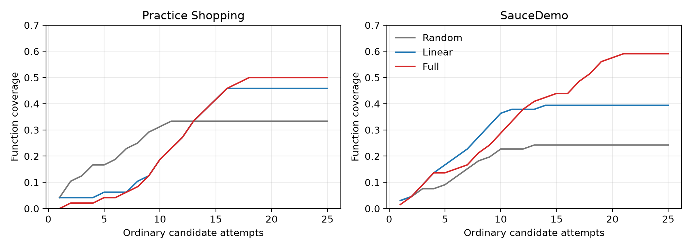
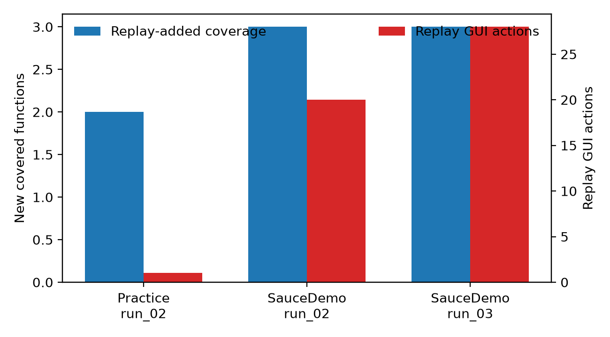

# E004 / C2 最终结果

覆盖映射以用户于 2026-09-19 接受的账本 v1 为准。每个网站的分母固定为 Practice Shopping 16、SauceDemo 22；同一功能在单个 run 中只计一次。三次重复用于描述统计，不作显著性主张。

## 主结果：功能覆盖率

| 网站 | 条件 | run_01 | run_02 | run_03 | 平均覆盖率 |
| --- | --- | ---: | ---: | ---: | ---: |
| Practice Shopping | Random | 5/16 | 7/16 | 4/16 | 33.3% |
| Practice Shopping | Linear | 7/16 | 7/16 | 8/16 | 45.8% |
| Practice Shopping | Full | 7/16 | 9/16 | 8/16 | 50.0% |
| SauceDemo | Random | 1/22 | 8/22 | 7/22 | 24.2% |
| SauceDemo | Linear | 10/22 | 10/22 | 6/22 | 39.4% |
| SauceDemo | Full | 12/22 | 14/22 | 13/22 | 59.1% |

按网站 macro-average：Random 28.8%，Linear 42.6%，Full 54.5%。Full 相对 Linear 为 +11.9 个百分点，相对 Random 为 +25.8 个百分点。

覆盖曲线将每个 condition 在同站点的三条 run 按 25 个普通 candidate-attempt 位置对齐；自然提前停止的 run 以其最终累计覆盖延长至预算上限。因此曲线显示的是在普通候选预算下的平均累计覆盖，而非实际继续执行的尝试。

## Replay：增益与成本

| Full run | replay 次数 | replay GUI actions | replay 后新增覆盖 | 说明 |
| --- | ---: | ---: | ---: | --- |
| Practice Shopping / run_02 | 1 | 1 | 2 | 网站较简单；仅此 run 需要 replay。 |
| SauceDemo / run_02 | 3 | 20 | 3 | 三次 replay 均成功。 |
| SauceDemo / run_03 | 4 | 28 | 3 | 三次成功 replay 成本 19；第 4 次 target-state mismatch 仍消耗 9。 |

Practice Shopping 的 Full / run_01 与 run_03 到达普通 25-attempt 上限前未产生可恢复 frontier，因此没有 replay；这不表示 replay 无效，而表示该站点的该两条轨迹未需要状态恢复。SauceDemo 三条 Full run 均发生 replay，合计 76 个 replay GUI actions，必须与其覆盖收益一起报告。

## 执行质量与停止

| 网站 | 条件 | 平均普通 attempts | executor 成功率 | failed | evidence-incomplete | replay / GUI |
| --- | --- | ---: | ---: | ---: | ---: | --- |
| Practice Shopping | Random | 13.33 | 62.5% (25/40) | 15 | 1 | 0 / 0 |
| Practice Shopping | Linear | 16.33 | 75.5% (37/49) | 12 | 5 | 0 / 0 |
| Practice Shopping | Full | 22.67 | 69.1% (47/68) | 21 | 10 | 1 / 1 |
| SauceDemo | Random | 9.00 | 70.4% (19/27) | 8 | 0 | 0 / 0 |
| SauceDemo | Linear | 11.33 | 94.1% (32/34) | 2 | 0 | 0 / 0 |
| SauceDemo | Full | 20.67 | 88.7% (55/62) | 7 | 0 | 11 / 76 |

14/18 有效 run 自然以 `current_state_exhausted` 或 `no_recoverable_frontier` 停止。Practice Shopping Full 的 run_01 与 run_03 因普通 25-attempt 上限停止；SauceDemo Full 的 run_01 与 run_03 因总 replay 上限停止。没有有效 run 因未处理异常而丢失可继续探索的 frontier。

## 可复算工件

- 覆盖映射：[c2_coverage_mapping_ledger_v1.md](c2_coverage_mapping_ledger_v1.md) 与 [CSV](c2_coverage_mapping_ledger_v1.csv)。
- 机器可读指标：[c2_metrics_consolidated_ai_initial.json](c2_metrics_consolidated_ai_initial.json)。
- 指标脚本：[analyze_c2.py](../../../scripts/paper/analyze_c2.py)；绘图脚本：[plot_c2.py](../../../scripts/paper/plot_c2.py)。
